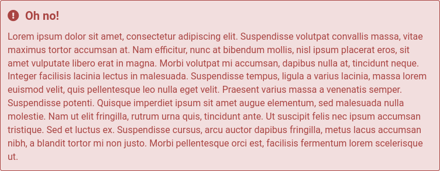
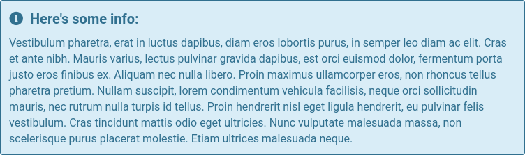
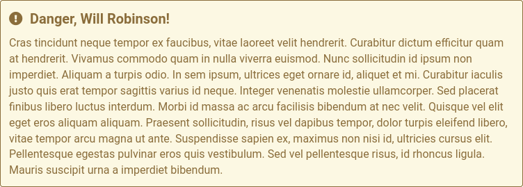

# Intro

Here are some miscellaneous helper programs for [GuidedTrack](https://guidedtrack.com). Enjoy!

# Index

## Math

### [`@jrc03c/check-if-matrix`](https://www.guidedtrack.com/programs/20507/edit)

Checks if `matrix` is a matrix (i.e., a non-jagged 2-dimensional collection). If it is, then `is_a_matrix` will be set to "yes"; otherwise, it will be set to "no".

### [`@jrc03c/check-if-vector`](https://www.guidedtrack.com/programs/20523/edit)

Checks if `vector` is a vector (i.e., a 1-dimensional collection). If it is, then `is_a_vector` will be set to "yes"; otherwise, it will be set to "no".

### [`@jrc03c/contains-only-numbers`](https://www.guidedtrack.com/programs/20579/edit)

Checks if `collection` contains only numerical values. If it does, then `contains_only_numbers` will be set to "yes"; otherwise, it will be set to "no".

### [`@jrc03c/dot`](https://www.guidedtrack.com/programs/20504/edit)

Given vectors or matrices `a` and `b`, it computes the dot product of `a` and `b` and stores it in `c`. Optionally, `a` and/or `b` can be transposed prior to computing the dot product by setting `should_transpose_a` and/or `should_transpose_b` to "yes".

### [`@jrc03c/matrix-transpose`](https://www.guidedtrack.com/programs/20498/edit)

Returns the transpose of `matrix` as `matrix`.

### [`@jrc03c/range`](https://www.guidedtrack.com/programs/20584/edit)

Given `start`, `stop`, and (optionally) `step` values, returns a collection called `range` in the range [`start`, `stop`) in which each value is separated by `step`.

## Status

### [`@jrc03c/show-error`](https://www.guidedtrack.com/programs/20556/edit)

Given `error_title` and `error_message`, it shows a red error message box. By default, the error is fatal; i.e., the program will halt (but not quit) when the program is invoked. However, to invoke the program in a non-fatal way, set `error_is_fatal` to "no".

### [`@jrc03c/show-info`](https://www.guidedtrack.com/programs/20559/edit)

Given `info_title` and `info_message`, it shows a blue info message box.

### [`@jrc03c/show-success`](https://www.guidedtrack.com/programs/20558/edit)

Given `success_title` and `success_message`, it shows a green success message box.

### [`@jrc03c/show-warning`](https://www.guidedtrack.com/programs/20557/edit)

Given `warning_title` and `warning_message`, it shows a yellow warning message box.

